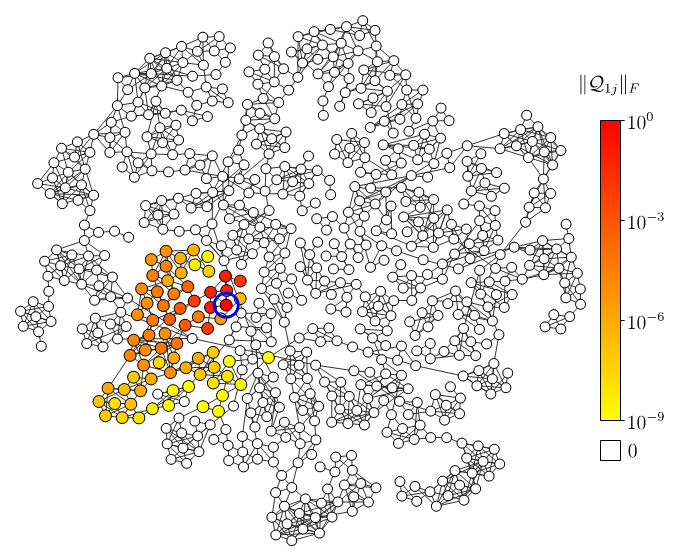
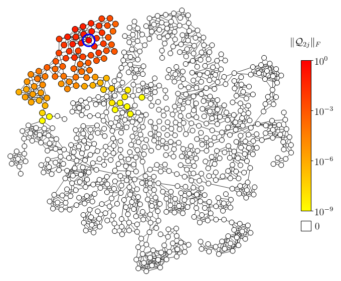
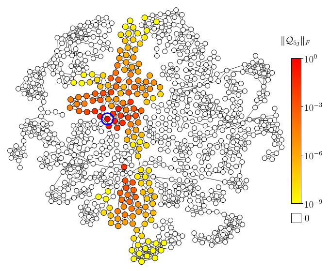
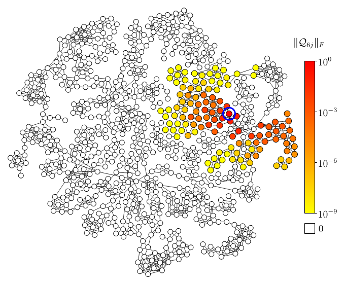
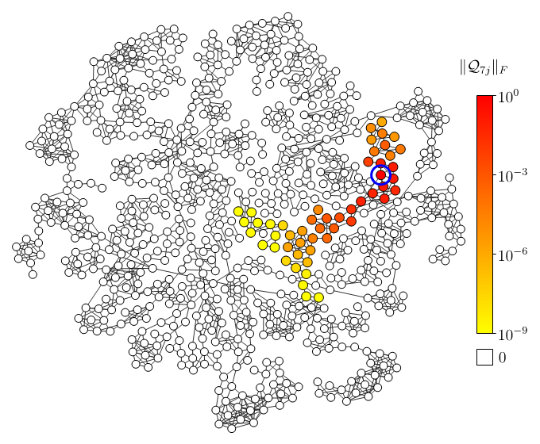

# Random Geometric Graphs

<table>
  <tr>
    <td> 1   
    <td> 2   
    <td> 3   
    <td> 4       
  </tr> 
  <tr>
    <td> 5   
    <td> 6   
    <td> 7   
    <td> 8       
  </tr>
</table>
