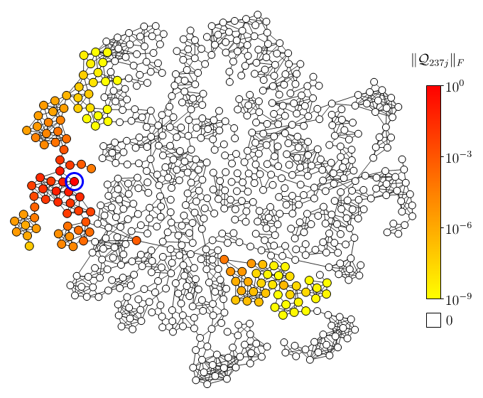
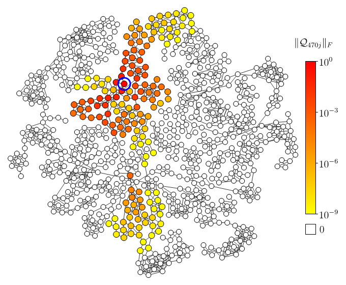
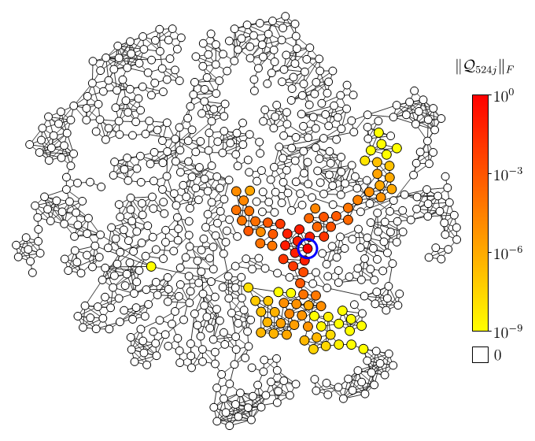
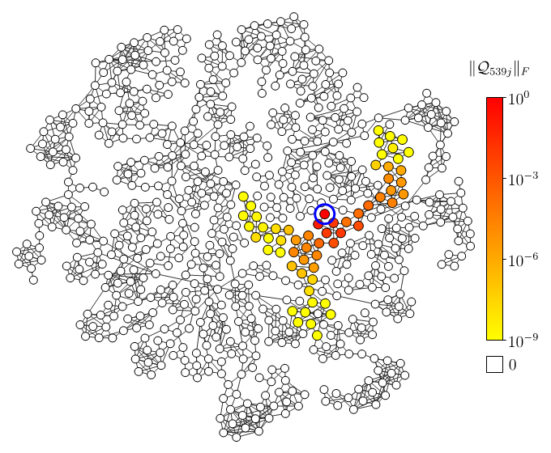
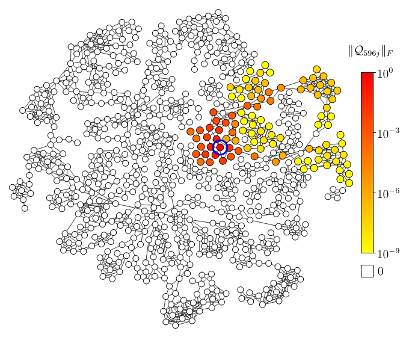
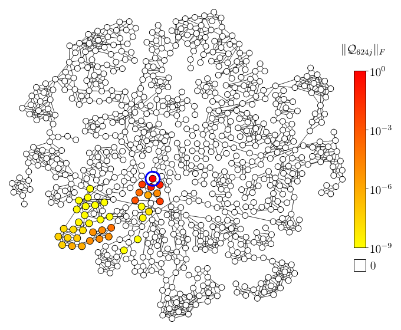

# Random Geometric Network

<table>
  <tr>
    <td> 1 
    <td> 2 
    <td> 3 
    <td> 4 
  </tr>
  <tr>
    <td> 5 
    <td> 6 
    <td> 7 
    <td> 8 
  </tr>
  <tr>
    <td> 9 
    <td> 10 
    <td> 11 
    <td> 12 
  </tr>
  <tr>
    <td> 13 
    <td> 14 
    <td> 15 
    <td> 16 
  </tr>
  <tr>
    <td> 17 
    <td> 18 
    <td> 19 
    <td> 20 
  </tr>
  <tr>
    <td> 21 
    <td> 22 
    <td> 23 
    <td> 24 
  </tr>
  <tr>
    <td> 25 
    <td> 26 
    <td> 27 
    <td> 28 
  </tr>
  <tr>
    <td> 29 
    <td> 30 
    <td> 31 
    <td> 32 
  </tr>
  <tr>
    <td> 33 
    <td> 34 
    <td> 35 
    <td> 36 
  </tr>
  <tr>
    <td> 37 
    <td> 38 
    <td> 39 
    <td> 40 
  </tr>
  <tr>
    <td> 41 
    <td> 42 
    <td> 43 
    <td> 44 
  </tr>
  <tr>
    <td> 45 
    <td> 46 
    <td> 47 
    <td> 48 
  </tr>
  <tr>
    <td> 49 
    <td> 50 
    <td> 51 
    <td> 52 
  </tr>
  <tr>
    <td> 53 
    <td> 54 
    <td> 55 
    <td> 56 
  </tr>
  <tr>
    <td> 57 
    <td> 58 
    <td> 59 
    <td> 60 
  </tr>
  <tr>
    <td> 61 
    <td> 62 
    <td> 63 
    <td> 64 
  </tr>
  <tr>
    <td> 65 
    <td> 66 
    <td> 67 
    <td> 68 
  </tr>
  <tr>
    <td> 69 
    <td> 70 
    <td> 71 
    <td> 72 
  </tr>
  <tr>
    <td> 73 
    <td> 74 
    <td> 75 
    <td> 76 
  </tr>
  <tr>
    <td> 77 
    <td> 78 
    <td> 79 
    <td> 80 
  </tr>
  <tr>
    <td> 81 
    <td> 82 
    <td> 83 
    <td> 84 
  </tr>
  <tr>
    <td> 85 
    <td> 86 
    <td> 87 
    <td> 88 
  </tr>
  <tr>
    <td> 89 
    <td> 90 
    <td> 91 
    <td> 92 
  </tr>
  <tr>
    <td> 93 
    <td> 94 
    <td> 95 
    <td> 96 
  </tr>
  <tr>
    <td> 97 
    <td> 98 
    <td> 99 
    <td> 100 
  </tr>
  <tr>
    <td> 101 
    <td> 102 
    <td> 103 
    <td> 104 
  </tr>
  <tr>
    <td> 105 
    <td> 106 
    <td> 107 
    <td> 108 
  </tr>
  <tr>
    <td> 109 
    <td> 110 
    <td> 111 
    <td> 112 
  </tr>
  <tr>
    <td> 113 
    <td> 114 
    <td> 115 
    <td> 116 
  </tr>
  <tr>
    <td> 117 
    <td> 118 
    <td> 119 
    <td> 120 
  </tr>
  <tr>
    <td> 121 
    <td> 122 
    <td> 123 
    <td> 124 
  </tr>
  <tr>
    <td> 125 
    <td> 126 
    <td> 127 
    <td> 128 
  </tr>
  <tr>
    <td> 129 
    <td> 130 
    <td> 131 
    <td> 132 
  </tr>
  <tr>
    <td> 133 
    <td> 134 
    <td> 135 
    <td> 136 
  </tr>
  <tr>
    <td> 137 
    <td> 138 
    <td> 139 
    <td> 140 
  </tr>
  <tr>
    <td> 141 
    <td> 142 
    <td> 143 
    <td> 144 
  </tr>
  <tr>
    <td> 145 
    <td> 146 
    <td> 147 
    <td> 148 
  </tr>
  <tr>
    <td> 149 
    <td> 150 
    <td> 151 
    <td> 152 
  </tr>
  <tr>
    <td> 153 
    <td> 154 
    <td> 155 
    <td> 156 
  </tr>
  <tr>
    <td> 157 
    <td> 158 
    <td> 159 
    <td> 160 
  </tr>
  <tr>
    <td> 161 
    <td> 162 
    <td> 163 
    <td> 164 
  </tr>
  <tr>
    <td> 165 
    <td> 166 
    <td> 167 
    <td> 168 
  </tr>
  <tr>
    <td> 169 
    <td> 170 
    <td> 171 
    <td> 172 
  </tr>
  <tr>
    <td> 173 
    <td> 174 
    <td> 175 
    <td> 176 
  </tr>
  <tr>
    <td> 177 
    <td> 178 
    <td> 179 
    <td> 180 
  </tr>
  <tr>
    <td> 181 
    <td> 182 
    <td> 183 
    <td> 184 
  </tr>
  <tr>
    <td> 185 
    <td> 186 
    <td> 187 
    <td> 188 
  </tr>
  <tr>
    <td> 189 
    <td> 190 
    <td> 191 
    <td> 192 
  </tr>
  <tr>
    <td> 193 
    <td> 194 
    <td> 195 
    <td> 196 
  </tr>
  <tr>
    <td> 197 
    <td> 198 
    <td> 199 
    <td> 200 
  </tr>
  <tr>
    <td> 201 
    <td> 202 
    <td> 203 
    <td> 204 
  </tr>
  <tr>
    <td> 205 
    <td> 206 
    <td> 207 
    <td> 208 
  </tr>
  <tr>
    <td> 209 
    <td> 210 
    <td> 211 
    <td> 212 
  </tr>
  <tr>
    <td> 213 
    <td> 214 
    <td> 215 
    <td> 216 
  </tr>
  <tr>
    <td> 217 
    <td> 218 
    <td> 219 
    <td> 220 
  </tr>
  <tr>
    <td> 221 
    <td> 222 
    <td> 223 
    <td> 224 
  </tr>
  <tr>
    <td> 225 
    <td> 226 
    <td> 227 
    <td> 228 
  </tr>
  <tr>
    <td> 229 
    <td> 230 
    <td> 231 
    <td> 232 
  </tr>
  <tr>
    <td> 233 
    <td> 234 
    <td> 235 
    <td> 236 
  </tr>
  <tr>
    <td> 237 
    <td> 238 
    <td> 239 
    <td> 240 
  </tr>
  <tr>
    <td> 241 
    <td> 242 
    <td> 243 
    <td> 244 
  </tr>
  <tr>
    <td> 245 
    <td> 246 
    <td> 247 
    <td> 248 
  </tr>
  <tr>
    <td> 249 
    <td> 250 
    <td> 251 
    <td> 252 
  </tr>
  <tr>
    <td> 253 
    <td> 254 
    <td> 255 
    <td> 256 
  </tr>
  <tr>
    <td> 257 
    <td> 258 
    <td> 259 
    <td> 260 
  </tr>
  <tr>
    <td> 261 
    <td> 262 
    <td> 263 
    <td> 264 
  </tr>
  <tr>
    <td> 265 
    <td> 266 
    <td> 267 
    <td> 268 
  </tr>
  <tr>
    <td> 269 
    <td> 270 
    <td> 271 
    <td> 272 
  </tr>
  <tr>
    <td> 273 
    <td> 274 
    <td> 275 
    <td> 276 
  </tr>
  <tr>
    <td> 277 
    <td> 278 
    <td> 279 
    <td> 280 
  </tr>
  <tr>
    <td> 281 
    <td> 282 
    <td> 283 
    <td> 284 
  </tr>
  <tr>
    <td> 285 
    <td> 286 
    <td> 287 
    <td> 288 
  </tr>
  <tr>
    <td> 289 
    <td> 290 
    <td> 291 
    <td> 292 
  </tr>
  <tr>
    <td> 293 
    <td> 294 
    <td> 295 
    <td> 296 
  </tr>
  <tr>
    <td> 297 
    <td> 298 
    <td> 299 
    <td> 300 
  </tr>
  <tr>
    <td> 301 
    <td> 302 
    <td> 303 
    <td> 304 
  </tr>
  <tr>
    <td> 305 
    <td> 306 
    <td> 307 
    <td> 308 
  </tr>
  <tr>
    <td> 309 
    <td> 310 
    <td> 311 
    <td> 312 
  </tr>
  <tr>
    <td> 313 
    <td> 314 
    <td> 315 
    <td> 316 
  </tr>
  <tr>
    <td> 317 
    <td> 318 
    <td> 319 
    <td> 320 
  </tr>
  <tr>
    <td> 321 
    <td> 322 
    <td> 323 
    <td> 324 
  </tr>
  <tr>
    <td> 325 
    <td> 326 
    <td> 327 
    <td> 328 
  </tr>
  <tr>
    <td> 329 
    <td> 330 
    <td> 331 
    <td> 332 
  </tr>
  <tr>
    <td> 333 
    <td> 334 
    <td> 335 
    <td> 336 
  </tr>
  <tr>
    <td> 337 
    <td> 338 
    <td> 339 
    <td> 340 
  </tr>
  <tr>
    <td> 341 
    <td> 342 
    <td> 343 
    <td> 344 
  </tr>
  <tr>
    <td> 345 
    <td> 346 
    <td> 347 
    <td> 348 
  </tr>
  <tr>
    <td> 349 
    <td> 350 
    <td> 351 
    <td> 352 
  </tr>
  <tr>
    <td> 353 
    <td> 354 
    <td> 355 
    <td> 356 
  </tr>
  <tr>
    <td> 357 
    <td> 358 
    <td> 359 
    <td> 360 
  </tr>
  <tr>
    <td> 361 
    <td> 362 
    <td> 363 
    <td> 364 
  </tr>
  <tr>
    <td> 365 
    <td> 366 
    <td> 367 
    <td> 368 
  </tr>
  <tr>
    <td> 369 
    <td> 370 
    <td> 371 
    <td> 372 
  </tr>
  <tr>
    <td> 373 
    <td> 374 
    <td> 375 
    <td> 376 
  </tr>
  <tr>
    <td> 377 
    <td> 378 
    <td> 379 
    <td> 380 
  </tr>
  <tr>
    <td> 381 
    <td> 382 
    <td> 383 
    <td> 384 
  </tr>
  <tr>
    <td> 385 
    <td> 386 
    <td> 387 
    <td> 388 
  </tr>
  <tr>
    <td> 389 
    <td> 390 
    <td> 391 
    <td> 392 
  </tr>
  <tr>
    <td> 393 
    <td> 394 
    <td> 395 
    <td> 396 
  </tr>
  <tr>
    <td> 397 
    <td> 398 
    <td> 399 
    <td> 400 
  </tr>
  <tr>
    <td> 401 
    <td> 402 
    <td> 403 
    <td> 404 
  </tr>
  <tr>
    <td> 405 
    <td> 406 
    <td> 407 
    <td> 408 
  </tr>
  <tr>
    <td> 409 
    <td> 410 
    <td> 411 
    <td> 412 
  </tr>
  <tr>
    <td> 413 
    <td> 414 
    <td> 415 
    <td> 416 
  </tr>
  <tr>
    <td> 417 
    <td> 418 
    <td> 419 
    <td> 420 
  </tr>
  <tr>
    <td> 421 
    <td> 422 
    <td> 423 
    <td> 424 
  </tr>
  <tr>
    <td> 425 
    <td> 426 
    <td> 427 
    <td> 428 
  </tr>
  <tr>
    <td> 429 
    <td> 430 
    <td> 431 
    <td> 432 
  </tr>
  <tr>
    <td> 433 
    <td> 434 
    <td> 435 
    <td> 436 
  </tr>
  <tr>
    <td> 437 
    <td> 438 
    <td> 439 
    <td> 440 
  </tr>
  <tr>
    <td> 441 
    <td> 442 
    <td> 443 
    <td> 444 
  </tr>
  <tr>
    <td> 445 
    <td> 446 
    <td> 447 
    <td> 448 
  </tr>
  <tr>
    <td> 449 
    <td> 450 
    <td> 451 
    <td> 452 
  </tr>
  <tr>
    <td> 453 
    <td> 454 
    <td> 455 
    <td> 456 
  </tr>
  <tr>
    <td> 457 
    <td> 458 
    <td> 459 
    <td> 460 
  </tr>
  <tr>
    <td> 461 
    <td> 462 
    <td> 463 
    <td> 464 
  </tr>
  <tr>
    <td> 465 
    <td> 466 
    <td> 467 
    <td> 468 
  </tr>
  <tr>
    <td> 469 
    <td> 470 
    <td> 471 
    <td> 472 
  </tr>
  <tr>
    <td> 473 
    <td> 474 
    <td> 475 
    <td> 476 
  </tr>
  <tr>
    <td> 477 
    <td> 478 
    <td> 479 
    <td> 480 
  </tr>
  <tr>
    <td> 481 
    <td> 482 
    <td> 483 
    <td> 484 
  </tr>
  <tr>
    <td> 485 
    <td> 486 
    <td> 487 
    <td> 488 
  </tr>
  <tr>
    <td> 489 
    <td> 490 
    <td> 491 
    <td> 492 
  </tr>
  <tr>
    <td> 493 
    <td> 494 
    <td> 495 
    <td> 496 
  </tr>
  <tr>
    <td> 497 
    <td> 498 
    <td> 499 
    <td> 500 
  </tr>
  <tr>
    <td> 501 
    <td> 502 
    <td> 503 
    <td> 504 
  </tr>
  <tr>
    <td> 505 
    <td> 506 
    <td> 507 
    <td> 508 
  </tr>
  <tr>
    <td> 509 
    <td> 510 
    <td> 511 
    <td> 512 
  </tr>
  <tr>
    <td> 513 
    <td> 514 
    <td> 515 
    <td> 516 
  </tr>
  <tr>
    <td> 517 
    <td> 518 
    <td> 519 
    <td> 520 
  </tr>
  <tr>
    <td> 521 
    <td> 522 
    <td> 523 
    <td> 524 
  </tr>
  <tr>
    <td> 525 
    <td> 526 
    <td> 527 
    <td> 528 
  </tr>
  <tr>
    <td> 529 
    <td> 530 
    <td> 531 
    <td> 532 
  </tr>
  <tr>
    <td> 533 
    <td> 534 
    <td> 535 
    <td> 536 
  </tr>
  <tr>
    <td> 537 
    <td> 538 
    <td> 539 
    <td> 540 
  </tr>
  <tr>
    <td> 541 
    <td> 542 
    <td> 543 
    <td> 544 
  </tr>
  <tr>
    <td> 545 
    <td> 546 
    <td> 547 
    <td> 548 
  </tr>
  <tr>
    <td> 549 
    <td> 550 
    <td> 551 
    <td> 552 
  </tr>
  <tr>
    <td> 553 
    <td> 554 
    <td> 555 
    <td> 556 
  </tr>
  <tr>
    <td> 557 
    <td> 558 
    <td> 559 
    <td> 560 
  </tr>
  <tr>
    <td> 561 
    <td> 562 
    <td> 563 
    <td> 564 
  </tr>
  <tr>
    <td> 565 
    <td> 566 
    <td> 567 
    <td> 568 
  </tr>
  <tr>
    <td> 569 
    <td> 570 
    <td> 571 
    <td> 572 
  </tr>
  <tr>
    <td> 573 
    <td> 574 
    <td> 575 
    <td> 576 
  </tr>
  <tr>
    <td> 577 
    <td> 578 
    <td> 579 
    <td> 580 
  </tr>
  <tr>
    <td> 581 
    <td> 582 
    <td> 583 
    <td> 584 
  </tr>
  <tr>
    <td> 585 
    <td> 586 
    <td> 587 
    <td> 588 
  </tr>
  <tr>
    <td> 589 
    <td> 590 
    <td> 591 
    <td> 592 
  </tr>
  <tr>
    <td> 593 
    <td> 594 
    <td> 595 
    <td> 596 
  </tr>
  <tr>
    <td> 597 
    <td> 598 
    <td> 599 
    <td> 600 
  </tr>
  <tr>
    <td> 601 
    <td> 602 
    <td> 603 
    <td> 604 
  </tr>
  <tr>
    <td> 605 
    <td> 606 
    <td> 607 
    <td> 608 
  </tr>
  <tr>
    <td> 609 
    <td> 610 
    <td> 611 
    <td> 612 
  </tr>
  <tr>
    <td> 613 
    <td> 614 
    <td> 615 
    <td> 616 
  </tr>
  <tr>
    <td> 617 
    <td> 618 
    <td> 619 
    <td> 620 
  </tr>
  <tr>
    <td> 621 
    <td> 622 
    <td> 623 
    <td> 624 
  </tr>
  <tr>
    <td> 625 
    <td> 626 
    <td> 627 
    <td> 628 
  </tr>
  <tr>
    <td> 629 
    <td> 630 
    <td> 631 
    <td> 632 
  </tr>
  <tr>
    <td> 633 
    <td> 634 
    <td> 635 
    <td> 636 
  </tr>
  <tr>
    <td> 637 
    <td> 638 
    <td> 639 
    <td> 640 
  </tr>
  <tr>
    <td> 641 
    <td> 642 
    <td> 643 
    <td> 644 
  </tr>
  <tr>
    <td> 645 
    <td> 646 
    <td> 647 
    <td> 648 
  </tr>
  <tr>
    <td> 649 
    <td> 650 
    <td> 651 
    <td> 652 
  </tr>
  <tr>
    <td> 653 
    <td> 654 
    <td> 655 
    <td> 656 
  </tr>
  <tr>
    <td> 657 
    <td> 658 
    <td> 659 
    <td> 660 
  </tr>
  <tr>
    <td> 661 
    <td> 662 
    <td> 663 
    <td> 664 
  </tr>
  <tr>
    <td> 665 
    <td> 666 
    <td> 667 
    <td> 668 
  </tr>
  <tr>
    <td> 669 
    <td> 670 
    <td> 671 
    <td> 672 
  </tr>
  <tr>
    <td> 673 
    <td> 674 
    <td> 675 
    <td> 676 
  </tr>
  <tr>
    <td> 677 
    <td> 678 
    <td> 679 
    <td> 680 
  </tr>
  <tr>
    <td> 681 
    <td> 682 
    <td> 683 
    <td> 684 
  </tr>
  <tr>
    <td> 685 
    <td> 686 
    <td> 687 
    <td> 688 
  </tr>
  <tr>
    <td> 689 
    <td> 690 
    <td> 691 
    <td> 692 
  </tr>
  <tr>
    <td> 693 
    <td> 694 
    <td> 695 
    <td> 696 
  </tr>
  <tr>
    <td> 697 
    <td> 698 
    <td> 699 
    <td> 700 
  </tr>
  <tr>
    <td> 701 
    <td> 702 
  </tr>
</table>
